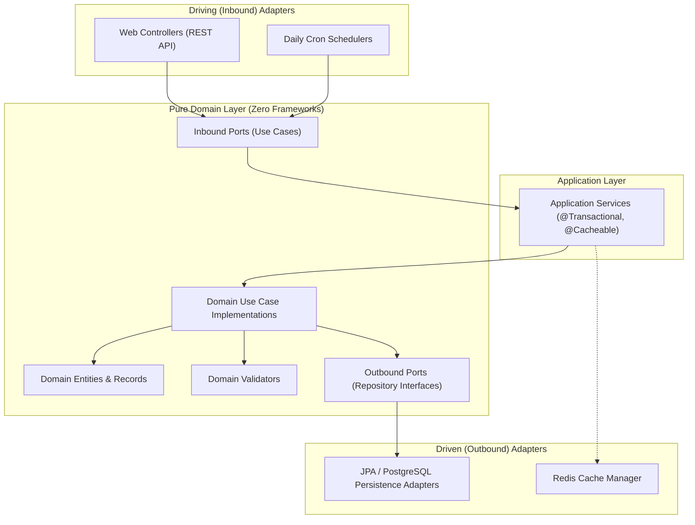
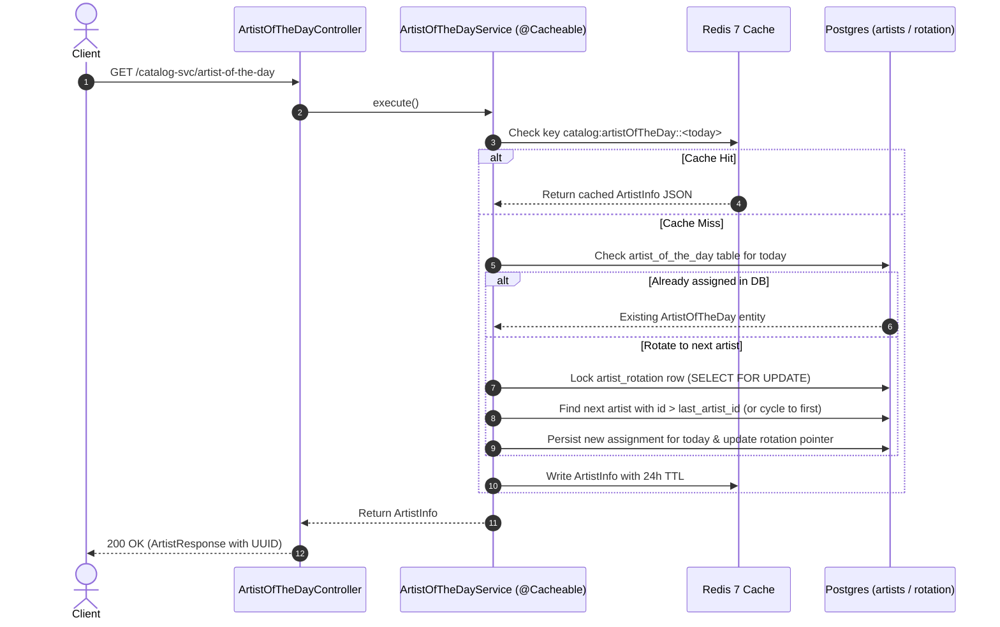

# Music Catalog Service (`catalog-service`)

[](https://openjdk.org/projects/jdk/21/)
[](https://spring.io/projects/spring-boot)
[](https://www.postgresql.org/)
[](https://redis.io/)
[](https://www.docker.com/)
[](http://localhost:8080/catalog-svc/swagger-ui.html)

A scalable, high-performance music catalog microservice built with **Java 21**, **Spring Boot 4**, **PostgreSQL**, and
**Redis**. Designed following **Hexagonal Architecture (Ports and Adapters)** and **Domain-Driven Design (DDD)**
principles.

---

## Table of Contents

- [Overview](#overview)
- [Architecture & Design Principles](#architecture--design-principles)
    - [Hexagonal Architecture (Ports & Adapters)](#hexagonal-architecture-ports--adapters)
    - [Domain-Driven Design (DDD)](#domain-driven-design-ddd)
    - [Key Architectural Decisions](#key-architectural-decisions)
- [Architecture Diagrams](#architecture-diagrams)
- [API Reference & Documentation](#api-reference)
    - [OpenAPI & Swagger UI](#openapi--swagger-ui)
    - [Interactive Demo UI](#interactive-demo-ui)
    - [Endpoints](#endpoints)
    - [Example Response Payloads](#example-response-payloads)
- [Project Structure](#project-structure)
- [Documentation Index (`docs/`)](#documentation-index-docs)
- [Configuration & Environment Variables](#configuration--environment-variables)
- [Getting Started](#getting-started)
    - [Prerequisites](#prerequisites)
    - [Running Supporting Services with Docker](#running-supporting-services-with-docker)
    - [Running the Application Locally](#running-the-application-locally)
    - [Running Full Stack with Docker Compose](#running-full-stack-with-docker-compose)
- [Testing Strategy](#testing-strategy)
- [Future Scalability & OpenSearch Roadmap](#future-scalability--opensearch-roadmap)

---

## Overview

The `catalog-service` manages music catalog operations:

- **User & Artist Management**: Register listeners and artists, update artist profiles, and maintain historical stage
  name aliases.
- **Track Management**: Add tracks linked to verified artists and query tracks using cursor-based pagination and
  filtering.
- **Artist of the Day Engine**: Deterministic circular rotation sequence that selects one featured artist per calendar
  day, backed by 24-hour distributed caching in Redis.

All endpoints are hosted under context path `/catalog-svc`.

---

## Architecture & Design Principles

### Hexagonal Architecture (Ports & Adapters)

The codebase strictly decouples business logic from external frameworks, databases, and network protocols:



1. **`domain/` (Core)**:
    - **Zero Framework Dependencies**: Contains pure Java models, record types, domain exceptions, and business rules.
      No JPA, Spring, or HTTP annotations.
    - **Inbound Ports**: Interfaces declaring business use cases (`CreateUserUseCase`, `UpdateUserUseCase`,
      `GetTracksUseCase`, `GetArtistOfTheDayUseCase`, etc.).
    - **Outbound Ports**: Interfaces declaring persistence contracts (`UserRepository`, `TrackRepository`,
      `ArtistCatalog`, `UserAliasRepository`).
2. **`application/` (Orchestration)**:
    - Contains application services decorated with cross-cutting concerns: `@Transactional`, `@Cacheable`, and Spring
      Service stereotypes.
3. **`adapter/in/` (Driving)**:
    - REST Controllers (`UserController`, `TrackController`, `UserAliasController`, `ArtistOfTheDayController`),
      Request/Response DTOs, and MapStruct mappers.
    - Schedulers (`ArtistOfTheDayScheduler`).
4. **`adapter/out/` (Driven)**:
    - PostgreSQL persistence layer: Spring Data JPA repositories, JPA entities (`User`, `Track`, `UserAlias`,
      `ArtistOfTheDay`, `ArtistRotation`), Specifications, and Keyset cursor pagination.

---

### Key Architectural Decisions

#### 1. Public UUID vs Internal Database Long ID Pattern

- **Problem**: Exposing auto-incrementing database `Long id`s invites enumeration attacks, leaks business metrics (e.g.
  total users registered), and creates tight coupling with database schema details.
- **Solution**:
    - `BaseEntity` and `BaseInfo` maintain an internal auto-incrementing `Long id` (used strictly inside database joins
      and foreign keys for performance) and a unique, immutable `UUID uuid`.
    - External REST endpoints exclusively accept and return `UUID`s via dedicated web response DTOs (`UserResponse`,
      `UserSummaryResponse`, `TrackResponse`, `UserAliasResponse`, `ArtistResponse`).
    - Response DTOs map the `UUID` to both `id` and `uuid` properties in JSON outputs, ensuring full client
      compatibility without leaking relational numeric IDs.

#### 2. High-Performance Keyset (Cursor-Based) Pagination

- **Problem**: Classic offset pagination (`OFFSET 10000 LIMIT 20`) suffers from $O (N)$ performance degradation as page
  numbers grow, and causes duplicate/missing items during concurrent writes.
- **Solution**:
    - Implemented keyset scroll pagination using [
      `CursorPaginationSupport`](file:///home/abdul-mueed-shahbaz/Projects/ice%20music%20svc/catalog-service/src/main/java/com/abdul/catalogservice/adapter/out/persistence/utils/pagination/CursorPaginationSupport.java)
      and [
      `CursorCodec`](file:///home/abdul-mueed-shahbaz/Projects/ice%20music%20svc/catalog-service/src/main/java/com/abdul/catalogservice/adapter/out/persistence/utils/codec/CursorCodec.java).
    - The API returns an opaque Base64-encoded cursor token pointing to the last evaluated item.
    - Queries execute an indexed comparison (e.g.
      `WHERE created_at < :cursorTimestamp OR (created_at = :cursorTimestamp AND id < :cursorId)`), keeping retrieval
      time $O (1)$ regardless of catalog depth.

#### 3. Redis 7 Distributed Caching

- Configured via Spring Cache abstraction with the Lettuce client and `commons-pool2` connection pooling.
- **Cache Name**: `artistOfTheDay`.
- **Key Strategy**: Parameterized by UTC date: `catalog:artistOfTheDay::<yyyy-MM-dd>`.
- **TTL**: 24 hours.
- **Resilience**: Custom [
  `CacheErrorHandler`](file:///home/abdul-mueed-shahbaz/Projects/ice%20music%20svc/catalog-service/src/main/java/com/abdul/catalogservice/config/RedisCacheConfig.java#L85-L119)
  logs Redis network/serialization failures as warnings and transparently falls back to PostgreSQL without breaking
  end-user HTTP traffic.

#### 4. Historical Artist Alias Tracking

- When an artist updates their stage name (`PATCH /catalog-svc/users/{userId}`), their previous name is automatically
  preserved in `user_aliases` with a normalized accent-folded token.
- Track filtering by artist name searches both the artist's current name and all historical aliases, ensuring tracks
  remain discoverable under prior monikers.

---

## Architecture Diagrams

### Artist of the Day Daily Rotation Sequence



---

## API Reference

### OpenAPI & Swagger UI

The service includes built-in OpenAPI 3 support powered by `springdoc-openapi` with automatic endpoint discovery:

- **Swagger UI**: [`http://localhost:8080/catalog-svc/swagger-ui.html`](http://localhost:8080/catalog-svc/swagger-ui.html) (or [`/catalog-svc/swagger-ui/index.html`](http://localhost:8080/catalog-svc/swagger-ui/index.html))
- **OpenAPI JSON Specification**: [`http://localhost:8080/catalog-svc/v3/api-docs`](http://localhost:8080/catalog-svc/v3/api-docs)

Use the Swagger UI to interactively inspect endpoints, view request/response DTO schemas, and execute live API calls directly from your browser.

### Interactive Demo UI

If you want to test and explore the API through a graphical user interface instead of Swagger or curl:

- **Demo UI Repository**: [tracks-catalog-svc-demo-ui](https://github.com/abdul-mueed-shz/tracks-catalog-svc-demo-ui)
- *Note*: This demo UI was "vibe coded" as a quick companion testing tool and is not part of this backend task.
- `catalog-service` has CORS pre-configured ([`WebCorsConfig`](file:///home/abdul-mueed-shahbaz/Projects/ice%20music%20svc/catalog-service/src/main/java/com/abdul/catalogservice/config/WebCorsConfig.java)) to allow seamless interaction from the frontend UI.

### Endpoints

All requests and responses use JSON and are prefixed with `/catalog-svc`.

| Method  | Endpoint                    | Description                                             | Request Body / Query Params                                                                                 | Response                                           |
|:--------|:----------------------------|:--------------------------------------------------------|:------------------------------------------------------------------------------------------------------------|:---------------------------------------------------|
| `POST`  | `/users`                    | Register a new user or artist                           | `{"name": "string", "isArtist": boolean}`                                                                   | `201 Created` (`UserResponse`) + `Location` header |
| `PATCH` | `/users/{userId}`           | Update user/artist name (stores previous name as alias) | `{"name": "string"}`                                                                                        | `200 OK` (`UserResponse`)                          |
| `GET`   | `/users/{userId}`           | Get user details by UUID                                | `{userId}` (UUID)                                                                                           | `200 OK` (`UserResponse`)                          |
| `GET`   | `/users`                    | List users with cursor pagination                       | Query params: `isArtist`, `size`, `cursor`, `property`, `direction`                                         | `200 OK` (`PageInfo<UserResponse>`)                |
| `GET`   | `/users/{userId}/aliases`   | Get historical aliases for an artist                    | `{userId}` (UUID)                                                                                           | `200 OK` (`List<UserAliasResponse>`)               |
| `POST`  | `/tracks/user/{userId}/add` | Add a track to an artist catalog                        | `{"title": "string", "genre": "string", "durationMs": int, "releaseDate": "YYYY-MM-DD"}`                    | `200 OK` (`TrackResponse`)                         |
| `GET`   | `/tracks`                   | Query tracks with cursor pagination                     | Query params: `userId` (UUID), `userName` (matches name/aliases), `size`, `cursor`, `property`, `direction` | `200 OK` (`PageInfo<TrackResponse>`)               |
| `GET`   | `/artist-of-the-day`        | Fetch current Artist of the Day (cached 24h)            | None                                                                                                        | `200 OK` (`ArtistResponse`)                        |
| `GET`   | `/actuator/health`          | Service health probes                                   | None                                                                                                        | `200 OK` (`{"status":"UP"}`)                       |

### Example Response Payloads

#### `UserResponse`

```json
{
  "id": "8eb04513-b6e2-4a2e-8937-9564911133b1",
  "uuid": "8eb04513-b6e2-4a2e-8937-9564911133b1",
  "name": "Beyoncé",
  "isArtist": true,
  "createdAt": "2026-10-01T12:00:00",
  "updatedAt": "2026-10-01T12:00:00"
}
```

#### `TrackResponse`

```json
{
  "id": "1c7a8b9e-0011-44aa-99bb-123456789abc",
  "uuid": "1c7a8b9e-0011-44aa-99bb-123456789abc",
  "title": "Halo",
  "genre": "Pop",
  "durationMs": 224000,
  "releaseDate": "2008-11-18",
  "user": {
    "id": "8eb04513-b6e2-4a2e-8937-9564911133b1",
    "uuid": "8eb04513-b6e2-4a2e-8937-9564911133b1",
    "name": "Beyoncé",
    "isArtist": true
  },
  "createdAt": "2026-10-01T12:30:00",
  "updatedAt": "2026-10-01T12:30:00"
}
```

---

## Project Structure

```
catalog-service/
├── .github/workflows/maven.yml             # GitHub Actions CI build & verification
├── compose.yaml                            # Docker Compose for local PostgreSQL 16 & Redis 7
├── docker-compose.dev.yaml                 # Full stack Compose (app + Postgres + Redis)
├── Dockerfile                              # Multi-stage container build (Eclipse Temurin JRE 17)
├── pom.xml                                 # Maven dependencies and build plugins
├── docs/                                   # Architectural diagrams and assignment specs
└── src/
    ├── main/
    │   ├── java/com/abdul/catalogservice/
    │   │   ├── adapter/
    │   │   │   ├── in/web/                 # REST Controllers, DTOs, Exception Handlers, Mappers
    │   │   │   ├── in/schedular/           # Scheduled Tasks (Artist of the day cron)
    │   │   │   ├── out/persistence/        # JPA Entities, Repositories, Specs, Cursor Pagination
    │   │   │   └── utils/                  # MapStruct annotation utilities
    │   │   ├── application/                # Application Services (@Transactional, @Cacheable)
    │   │   ├── domain/                     # Pure DDD models, use cases, ports, and validators
    │   │   └── config/                     # DomainConfig, OpenApiConfig, PersistenceAuditingConfig, RedisCacheConfig, WebCorsConfig
    │   └── resources/
    │       ├── application.yml             # Base configuration (datasource, redis, cache, lettuce)
    │       └── application-dev.yml         # Dev profile overrides
    └── test/
        ├── java/com/abdul/catalogservice/
        │   ├── unit/                       # Isolated Mockito unit tests
        │   └── integration/                # End-to-end API tests with Testcontainers & Rest Assured
        └── resources/
            └── application-test.yml        # Test configuration
```

---

## Documentation Index (`docs/`)

The [`docs/`](file:///home/abdul-mueed-shahbaz/Projects/ice%20music%20svc/catalog-service/docs) folder contains
foundational design and requirement assets:

- **[
  `docs/01-TakeHomeTask-Candidate.pdf`](file:///home/abdul-mueed-shahbaz/Projects/ice%20music%20svc/catalog-service/docs/01-TakeHomeTask-Candidate.pdf)**:
  The core system specification and functional requirements document.
- **[
  `docs/hexagonal-pattern.png`](file:///home/abdul-mueed-shahbaz/Projects/ice%20music%20svc/catalog-service/docs/hexagonal-pattern.png)**:
  Visual diagram of the Hexagonal (Ports & Adapters) boundaries implemented across the project.
- **[
  `docs/Architechture-Plan.png`](file:///home/abdul-mueed-shahbaz/Projects/ice%20music%20svc/catalog-service/docs/Architechture-Plan.png)**:
  High-level system architecture and component interaction plan.
- **[`docs/todos`](file:///home/abdul-mueed-shahbaz/Projects/ice%20music%20svc/catalog-service/docs/todos)**: Technical
  debt tracker and roadmap improvements checklist.

---

## Configuration & Environment Variables

The service is fully configurable via standard environment variables or `application.yml`:

| Property                                    | Default Value                              | Environment Variable                        | Purpose                                        |
|:--------------------------------------------|:-------------------------------------------|:--------------------------------------------|:-----------------------------------------------|
| `server.port`                               | `8080`                                     | `SERVER_PORT`                               | HTTP server port                               |
| `server.address`                            | `0.0.0.0`                                  | `SERVER_ADDRESS`                            | Network binding interface                      |
| `spring.datasource.url`                     | `jdbc:postgresql://localhost:5432/catalog` | `SPRING_DATASOURCE_URL`                     | PostgreSQL JDBC connection URL                 |
| `spring.datasource.username`                | `myuser`                                   | `SPRING_DATASOURCE_USERNAME`                | Database username                              |
| `spring.datasource.password`                | `secret`                                   | `SPRING_DATASOURCE_PASSWORD`                | Database password                              |
| `spring.jpa.hibernate.ddl-auto`             | `update`                                   | `SPRING_JPA_HIBERNATE_DDL_AUTO`             | Hibernate schema management                    |
| `spring.data.redis.host`                    | `localhost`                                | `SPRING_DATA_REDIS_HOST`                    | Redis server hostname                          |
| `spring.data.redis.port`                    | `6379`                                     | `SPRING_DATA_REDIS_PORT`                    | Redis port                                     |
| `spring.data.redis.password`                | *(empty)*                                  | `SPRING_DATA_REDIS_PASSWORD`                | Redis authentication password                  |
| `spring.data.redis.lettuce.pool.max-active` | `16`                                       | `SPRING_DATA_REDIS_LETTUCE_POOL_MAX_ACTIVE` | Max active Redis connections                   |
| `spring.cache.type`                         | `redis`                                    | `SPRING_CACHE_TYPE`                         | Cache abstraction provider (`redis` or `none`) |
| `spring.cache.redis.time-to-live`           | `1d`                                       | `SPRING_CACHE_REDIS_TIME_TO_LIVE`           | Default cache TTL                              |
| `spring.cache.redis.key-prefix`             | `catalog:`                                 | `SPRING_CACHE_REDIS_KEY_PREFIX`             | Redis cache key prefix                         |

---

## Getting Started

### Prerequisites

- **Java 21** (or compatible JDK)
- **Maven 3.9+** (or use the provided `./mvnw` wrapper)
- **Docker & Docker Compose**

### Running Supporting Services with Docker

To start PostgreSQL and Redis in the background:

```bash
docker compose -f compose.yaml up -d
```

Verify the health of the containers:

```bash
docker compose -f compose.yaml ps
```

### Running the Application Locally

Run with the default configuration (connects to `localhost:5432` and `localhost:6379`):

```bash
./mvnw spring-boot:run
```

Or with the `dev` profile:

```bash
./mvnw spring-boot:run -Dspring-boot.run.profiles=dev
```

The application will start at `http://localhost:8080/catalog-svc`.

Once running, you can access:
- **Swagger UI**: [`http://localhost:8080/catalog-svc/swagger-ui.html`](http://localhost:8080/catalog-svc/swagger-ui.html)
- **OpenAPI JSON Docs**: [`http://localhost:8080/catalog-svc/v3/api-docs`](http://localhost:8080/catalog-svc/v3/api-docs)
- **Demo UI**: [tracks-catalog-svc-demo-ui](https://github.com/abdul-mueed-shz/tracks-catalog-svc-demo-ui) (for testing through a web UI)

### Running Full Stack with Docker Compose

To build the application container and start the complete environment (Postgres + Redis + App):

```bash
docker compose -f docker-compose.dev.yaml up -d --build
```

To shut down the full stack:

```bash
docker compose -f docker-compose.dev.yaml down
```

---

## Testing Strategy

The service employs a comprehensive test suite aligned with the **Testing Pyramid**:

### 1. Isolated Unit Tests (`src/test/java/.../unit`)

- Test domain logic, use cases, validators, and utility codecs in pure isolation.
- Executed with Mockito without loading Spring contexts or network ports.
- Run unit tests:
  ```bash
  mvn test
  ```

### 2. End-to-End API Integration Tests (`src/test/java/.../integration`)

- Powered by **Testcontainers**: Automatically spins up disposable PostgreSQL 16 and Redis 7 containers.
- Powered by **REST Assured**: Executes genuine HTTP requests against the running test server and validates contract
  status codes, headers, and JSON bodies.
- Powered by **`MutableClock`**: Custom injectable clock allowing tests to time-travel forward across calendar days to
  verify the deterministic daily artist rotation.
- Run integration tests:
  ```bash
  mvn verify
  ```

---

## Future Scalability & OpenSearch Roadmap

As documented in [`docs/todos`](file:///home/abdul-mueed-shahbaz/Projects/ice%20music%20svc/catalog-service/docs/todos),
track search by artist name or alias currently utilizes PostgreSQL `LIKE '%...%'` queries with an `EXISTS` subquery.

For hyperscale deployments on AWS:

- **OpenSearch / Elasticsearch**: Offload full-text search, fuzzy typo tolerance, and prefix autocomplete to Amazon
  OpenSearch Service.